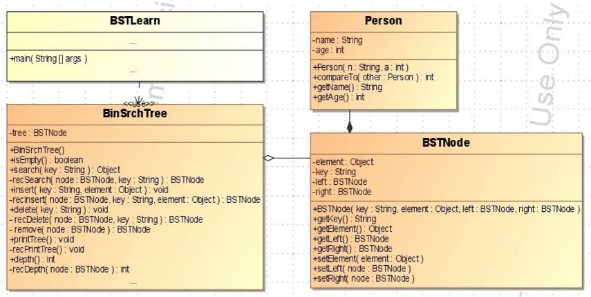

# A Link-based Binary Search Tree

## Purpose
The purpose of this lab is to gain greater understanding of binary search trees,
as well as work together successfully with a pair programmer.
## Evaluation
Students will be awarded up to 10 points for successfully completing this lab as
outlined below.

## Prelab
Complete the questions on the answer sheet using your text prior to beginning
the lab activities.

## Modify the Binary Search Tree program


Take a few minutes to examine the UML class diagram and the code with your
partner.

Run the program. After the output is displayed, look at the code in your main
method and supporting classes and answer the following questions. You’ll find a
place to answer on your answer sheet.

* What values are being printed from the ```printTree``` method?
* In which class are these values actually being stored as data members?
* In what order (PREorder/POSTorder/INorder) does the print method visit the nodes in the tree?
* How would you make this method print in the other two orders?

## Search Method
Implement the ability to search for a key value with your tree. Study to
understand how the ```insert``` method works and apply the same logic to this
```recSearch```.

## Delete Method
Implement the ability to delete a node with your tree. Our binary search tree
implements the delete operation with three methods: ```delete```,
```recDelete```, and ```remove```. The delete method simply calls the recursive
delete method. The algorithm for recDelete is similar to the search method.
The difference lies in the remove method. Basically, these methods work in the
following way:
1. The delete method is called from main with the key of the node to delete
1. The recDelete method is called from ```delete``` with the key and the root of
   a tree
1. Once the node to delete is found, the remove method is called. The remove
   method takes care of the three possible cases:
These methods are shown below:
```
public void delete (String key)
// PRE: init <key>
// POS: exit<tree> = entry<tree> - node<key>
// TAS: Call the recursive delete method with the root and  the key
{
  root = recDelete (root,key);
}//delete

private BSTNode recDelete (BSTNode node, String key)
// PRE: init <node>, init<key>
// POS: exit<tree> = entry<tree> - node<key>
// TAS: Find the node to delete and call remove if found
{
  if (node == null) {
    System.out.println ("Unable to find node with key.");
    return null;
  }else if (key.compareTo(node.getKey()) == 0) {
    node = remove (node);
  }else if (key.compareTo (node.getKey()) < 0) {
    node.setLeft(recDelete(node.getLeft(), key));
  }else {
    node.setRight(recDelete(node.getRight(), key));
  }
  return node;
}// recDelete

private BSTNode remove (BSTNode node) {
  // PRE: node points to delete node
  // POS: exit<tree> = entry<tree> - node<key>
  // TAS: Delete the node and reattach subtrees of deleted node
  BSTNode here = node;
  if (node.getLeft() == null) {       // CASE 1: Right Child Only
    return node.getRight();           // attach right subtree
  }else if (node.getRight() == null){  // CASE 2: Left Child Only
    return node.getLeft();             // attach left subtree
  }else {                           // CASE 3: both L & R children
    node = node.getRight ();        // point to right child
    BSTNode temp = node;            // set temp to node
    while (temp.getLeft() != null){ // find node in right
      temp = temp.getLeft();        // subtree w largest key
    }
    temp.setLeft (here.getLeft());  // attach left subtree
    return node;                    // quit
  }//else
}
```
