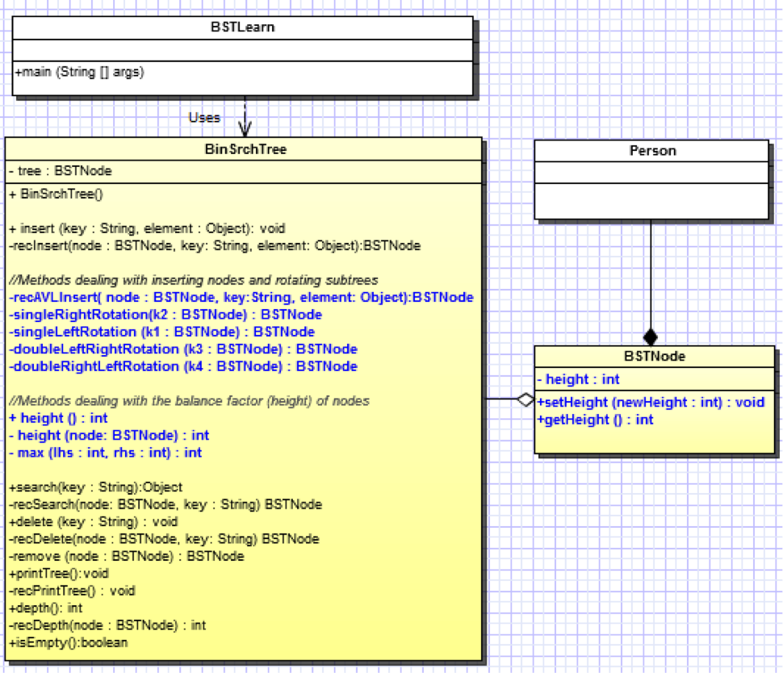

# AVL Tree
## Purpose
The purpose of this lab is to implement an AVL tree.

## Prelab
Answer the questions on the answer sheet using your text prior to beginning the
lab activites.

## AVL Tree
You will make our Binary Search Tree (from last lab) into an AVL tree as shown
in the following UML. The new methods we need to implment are in blue.



### Step 1: Modify the BSTNode class
To implement an AVL tree you will need to modify our implementation of the
BSTNode. Recall that in an AVL tree, each node has a balance factor which will
be used to decide if a rotation needs to be accomplished. Although each node
will not store a balance factor in our tree, we will store a height value which
will be used to calculate the balance factor.

1. As shown in the UML, modify your BSTNode class so that it stores an integer
  called ```height```. In the constructor for the class, set the initial height
  to 0. You can use the ```protected``` visibility modifier so that code in
  ```BinSrchTree``` class can referece this ```height``` variable directly:
```
protected int height;
```
2. Create an accessor(get method) and a mutator(set method) for the height.

### Step 2: Modify the BinSrchTree class
Most of the work we will need to do will take place in the BinSrchTree class.
Begin by creating some methods that deal with the height of the AVL tree.

1. Implement a method called ```height``` which returns the height of the tree
  with ```node``` as the root if the tree is not empty -- ```node``` is not
  null. Effectively, an empty tree has a height value of ```-1```. Shown below
  is one implementation. Note that the implementation uses a short-hand if
  statement which can be read as "if the node is null, then return ```-1```,
  otherwise return ```node.getHeight()```."
```
private int height( BSTNode node ){
  //PRE: none
  //POS: none
  //TAS: if the node is null return -1, else return the height in the node
  return node == null ? -1 : node.getHeight();
}
```

2. implement a public height method which will report the height of the entire
  tree.
```
public int height(){
  return height(root);
}
```

3. Implement the four rotation methods as shown below:
```
private BSTNode singleRightRotation( BSTNode k2 ){
  //TASK: Rotate the left child up and to the right to
  //      become the new root of this subtree
  BSTNode k1 = k2.left;
  k2.left = k1.right;
  k1.right = k2;
  k2.height = Math.max( height( k2.left ), height( k2.right ) ) + 1;
  k1.height = Math.max( height( k1.left ), k2.height ) + 1;
  return k1;
}

private BSTNode singleLeftRotation( BSTNode k1 ){
  //TASK: Rotate the right child up and to the left to
  //      become the new root of this subtree
  BSTNode k2 = k1.right;
  k1.right = k2.left;
  k2.left = k1;
  k1.height = Math.max( height( k1.left ), height( k1.right ) ) + 1;
  k2.height = Math.max( height( k2.right ), k1.height ) + 1;
  return k2;
}

private BSTNode doubleLeftRightRotation( BSTNode k3 ){
  //TASK: Rotate the left subtree to the left, then up
  //      and to the right to become the new root of this subtree
  k3.left = singleLeftRotation( k3.left );
  return singleRightRotation( k3 );
}

private BSTNode doubleRightLeftRotation( BSTNode k4 ){
  //TASK: Rotate the right subtree to the right, then up and to
  //      the left to become the new root of this subtree
  k4.right = singleRightRotation( k4.right );
  return singleLeftRotation( k4 );
}
```

### Step 3: Create a recursive AVL insert method
Create a new insert method for your tree. Leave the old one as well. We will
want to compare what happens when you use the two different insert techniques.
You might take some time to study the comments.
```
private BSTNode recAVLInsert (BSTNode node, String key, Object element){
  if (node == null){
    // empty spot? insert here.
    node = new BSTNode (key, element, null, null);
  }else if (key.compareTo (node.getKey ()) < 0){
    // insert in left subtree
    node.setLeft (recAVLInsert (node.getLeft (), key, element));
    // AFTER inserting, it is possible the tree is out of balance, so check
    // subtree heights
    if(height(node.getRight())- height(node.getLeft()) == -2){
      // if true, left subtree too tall
      // decide what sort of rotation will fix the problem
      if(key.compareTo( node.getLeft().getKey()) < 0 ){
        // inserted into left subtree of left child
        // fix with a single right rotation
        node = singleRightRotation( node );
      }else{
        // inserted into right subtree of left child
        // so double rotation is necessary
        node = doubleLeftRightRotation( node );
      }
    }
  }else{
    // insert in right subtree
    // shown below is simply the mirror image of what we did above
    node.setRight (recAVLInsert (node.getRight (), key, element));
    if( height( node.getRight() ) - height( node.getLeft() ) == 2 ){
      if( key.compareTo( node.getRight().getKey()) > 0 ){
        node = singleLeftRotation( node );
      }else{
        node = doubleRightLeftRotation( node );
      }
    }
  }//else

  // We are done, but now we need to reset the height of this node after the
  // insertion
  node.setHeight(Math.max( height(node.getLeft()), height(node.getRight())) + 1);
  return node;
}
```

### Step 4: Testing
Insert 10 sorted items into your tree using the old insert method. One way to
do this is as shown below:
```
//Create 10 people to insert into the tree.
Person a = new Person("Sue", 48);
Person b = new Person("Tim", 44);
Person c = new Person ("Rachel", 22);
Person d = new Person ("Jim", 18);
Person e = new Person ("Sid", 18);
Person f = new Person("Sue", 48);
Person g = new Person("Tim", 44);
Person h = new Person ("Rachel", 22);
Person i = new Person ("Jim", 18);
Person j = new Person ("Sid", 18);

//Insert the persons in the tree and display the height as it changes
tree.insert("A", a);
System.out.println("The height is: "+tree.height());
tree.insert("B", b);
System.out.println("The height is: "+tree.height());
tree.insert("C", c);
System.out.println("The height is: "+tree.height());
tree.insert("D", d);
System.out.println("The height is: "+tree.height());
tree.insert("E", e);
System.out.println("The height is: "+tree.height());
tree.insert("F", f);
System.out.println("The height is: "+tree.height());
tree.insert("G", g);
System.out.println("The height is: "+tree.height());
tree.insert("H", h);
System.out.println("The height is: "+tree.height());
tree.insert("I", i);
System.out.println("The height is: "+tree.height());
tree.insert("J", j);
System.out.println("The height is: "+tree.height());
```
Answer the following questions on your answer sheet:
* What is the height of the tree?
* Is this tree "bushy" or "degenerate"?
* BEFORE we use the new and improved ```recAVLInsert``` method, work with your
  partner/team, sketch on your own paper the AVL tree that would result from
  inserting the keys shown in steps above.
* Now, change the ```insert``` method in the ```BinSrchTree``` class so it calls
  the ```recAVLInsert``` method instead of the ```recInsert``` Method. Rerun
  your program.
* What is the height of your tree using the ```recAVLInsert``` method?
* When you have completed this step, call your instructor over and demonstrate
  your running program.  Obtain your instructor's initials.
