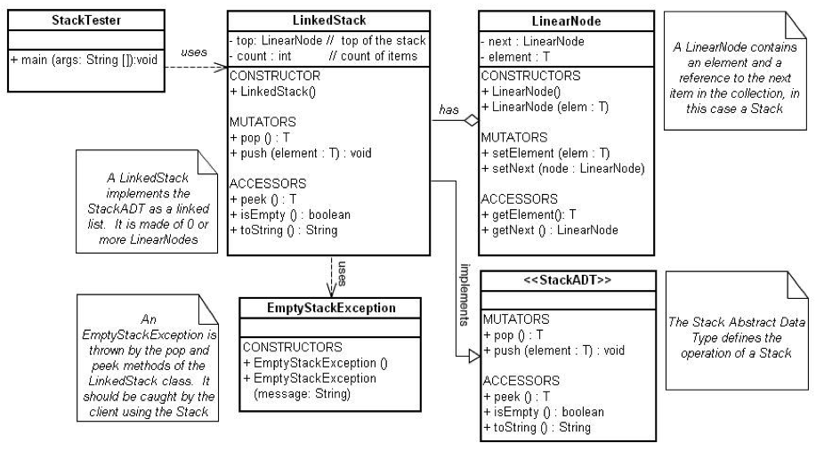

# Lab 3 Linked Stack
## Purpose
The purpose of this lab is to complete the implementation of a Linked Stack ADT as described in the lab instructions below.  The Stack ADT was chosen because the student is already familiar with stack operations.   Additionally, the successful student will gain significant insight into the use of generics.  
## Evaluation
Students will be awarded up to 10 points for successfully completing this lab as outlined below.
## Step 1: Design
As you begin your lab, study the UML Diagram below and answer the questions on your answer sheet.  This design will guide the roadmap through the lab this week.


## Step 2: Obtain Starter Code
Create a clone of this repository in your cloud9 workspace. You will see 5 Java source files in the repository directory.
* StackADT.java
* LinearNode.java
* LinkedStack.java
* StackTester.java
* EmptyStackException.java

Compile these Java source files with the following command:
```
javac *.java
```
## Step 3: Run the StackTester Class
The main method is found in the StackTester class. Run the file using the following command
```
java StackTester
```
You should see something like what is shown below.  The "cba" is being returned from a call to the toString() method, not by peek or pop.
## Step 4: Implementing the pop()
Using your text as a reference, implement and test the pop method.  You will find the code for the pop method on page 88 of your text.
NOTE: We are using an ```EmptyStackException``` rather than the ```EmptyCollectionException``` as shown in your text.

After getting your ```LinkedStack``` class to compile with your new pop method, test the pop method by placing the following code in the main method of your client:
```Java
// Create an empty linked stack named ls
LinkedStack<Character> ls = new LinkedStack<Character>();

// Push several items onto the stack and print the
// contents with an implicit call to toString method

ls.push (new Character ('a'));
ls.push (new Character ('b'));
ls.push (new Character ('c'));
System.out.println(ls);

// Popping the stack has the potential of throwing an
// exception, so place inside a try catch block

try {
  ls.pop();
  ls.pop();
  ls.pop();
  ls.pop();
} catch (EmptyStackException e) {
  System.out.println ("Stack is empty");
}
```

## Step 5:	Alternatives to Exceptions
The situation of popping from an empty stack can be handled without using a try catch block.

* First, simply remove the ```try-catch``` block from around the calls to the pop method and rerun your program.  Read about exception propagation and answer question 10 on your answer sheet.
* Now, rewrite your main method using an if statement and the isEmpty() method to accomplish the same goal (guarding against popping or peeking an empty stack) as the ```try-catch``` block.

Exceptions are the final safeguard against improper use of a data structure.  In general, however, it is better software engineering practice to use an “if” statement unless an exception handler is absolutely necessary.  Step 5 is an example of a way to write safe code without using exceptions to catch erroneous or improper access.

## Step 6: Drawing Pictures
In class you have seen how to trace the push method using snapshots of the stack.  Answer question 11 on your answer sheet.

## Step 7: peek()
Using the knowledge you gained by studying the push and pop methods, write and test a peek method.
* Handwrite the code for your peek method on the back of your answer sheet BEFORE you type it into your file.
* Call your instructor over and explain how your method works. Draw pictures to explain your method.

## Step 8: Efficiency
On the back of your lab answer sheet, list all of the current methods in the LinkedStack class and their efficiency categories.  

## Step 9: contains()
Implement and test the contains method.

## Step 10: Finish Up
When you have successfully answered all the lab questions, and written and tested the pop and peek methods of the LinkedStack class, you are finished.

Push your code to github and turn in your answer sheet.
